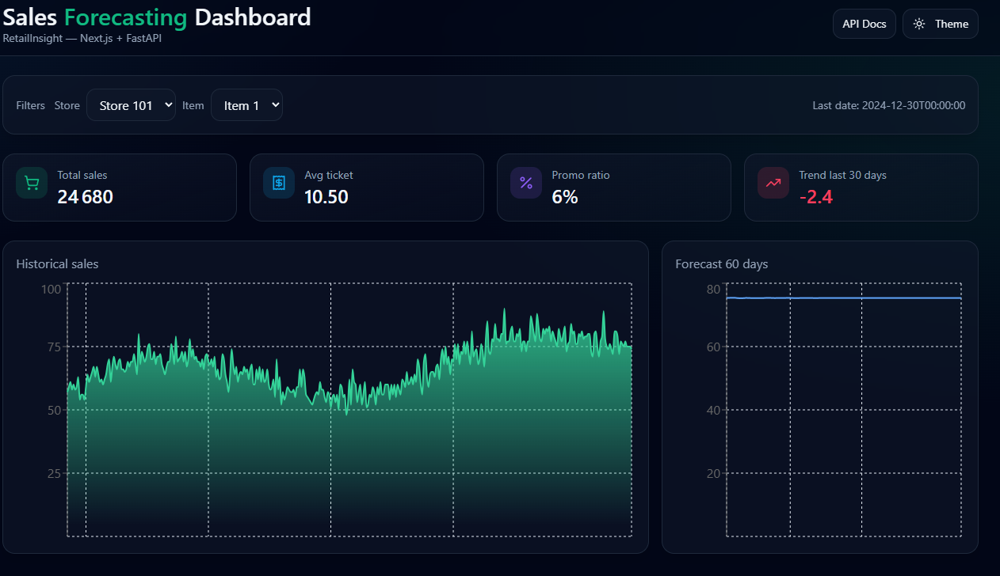
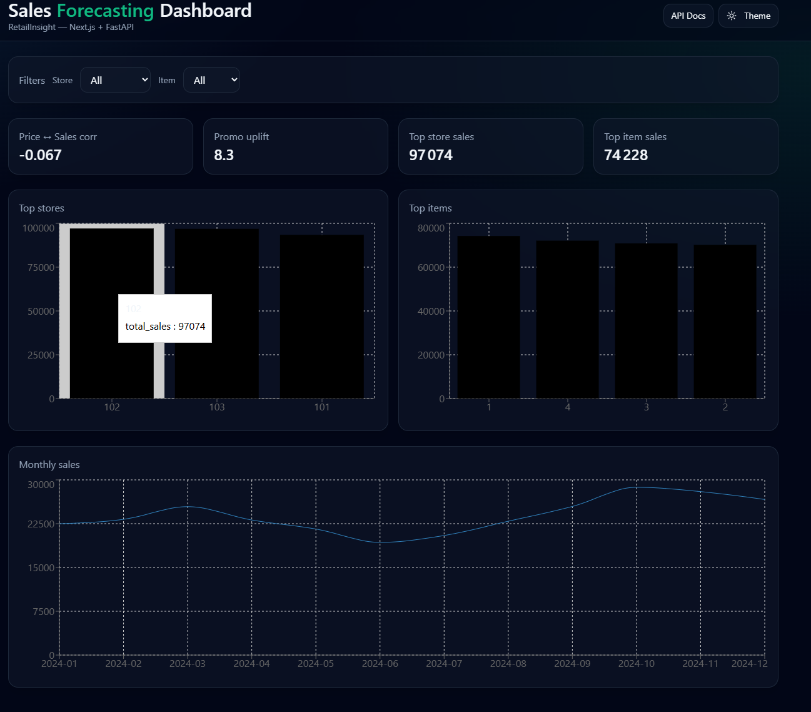
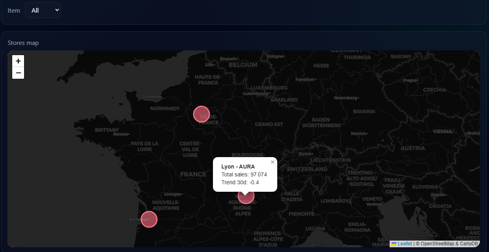

<h1 align="center">🛍️ RetailInsight – Sales Forecasting, Insights & Store Map</h1>

<p align="center">
  <b>FastAPI (Python) + Next.js (TypeScript)</b> - forecast & visualize daily sales per store & item with KPIs, business insights and a Leaflet store map.
  <br/>
  <i>by <a href="https://github.com/TifraYanis" target="_blank">Tifra Yanis</a> - Data Science Portfolio</i>
</p>

---

## 🧠 Overview

**RetailInsight** is a *product-style data science app* built to look and feel like a real analytics tool used in retail:
- Explore **daily sales** per store & item.
- Monitor **KPIs** (total sales, avg ticket, promo ratio, trend).
- Generate **60‑day forecasts** (SARIMAX baseline).
- Discover **business insights** (top stores/items, price↔sales correlation, promo uplift, monthly curve).
- Visualize stores on a **Leaflet map** (size ≈ volume, color = 30‑day trend).

**Backend:** FastAPI (Pandas + SARIMAX) → `/sales`, `/kpis`, `/forecast`, `/insights`, `/stores`  
**Frontend:** Next.js 14 (TypeScript) + Tailwind + Recharts + Leaflet + dark/light theme

---

## 🖼️ Screenshots






---

## ⚙️ Installation (third‑party friendly)

### 1) Backend
```bash
cd backend
python -m venv .venv
# Windows: .venv\Scripts\activate
# macOS/Linux: source .venv/bin/activate

pip install -r requirements.txt
uvicorn --app-dir src retailinsight.api:app --reload --port 8000
# → http://localhost:8000/docs
```

### 2) Frontend
```bash
cd ../frontend
npm install
npm run dev
# → http://localhost:3000 (expects API at http://localhost:8000)
```

---

## 🔗 API Endpoints

| Route | Description |
|------|-------------|
| `GET /sales?store_id=101&item_id=1&limit=365` | Daily sales slice |
| `GET /kpis?store_id=101&item_id=1` | total_sales, avg_ticket, promo_ratio, trend_30d |
| `GET /forecast?store_id=101&item_id=1&steps=60` | 60‑day forecast (SARIMAX) |
| `GET /insights?store_id=&item_id=` | top stores/items, price↔sales corr, promo uplift, monthly |
| `GET /stores?item_id=` | store geo + performance (for Leaflet) |

---

## 🧱 Tech Stack & Choices

| Layer | Choice | Why |
|------|--------|-----|
| **ML** | SARIMAX (weekly seasonality) | Robust, interpretable baseline for TS |
| **API** | FastAPI | Typed, fast, OpenAPI docs |
| **Front** | Next.js 14 + TypeScript | Modern DX, server‑ready |
| **UI** | Tailwind, Recharts, Leaflet | Clean charts + geoviz + theme toggle |
| **Theme** | next‑themes (dark/light) | Portfolio‑grade look |
| **Data** | Synthetic CSV | Swap later for real POS/ERP |

---

## 🧭 How to Use
1. Pick **Store** and **Item** on the Dashboard → read KPIs & real‑time charts.  
2. Go to **Insights** → top performers, correlation price↔sales, promo uplift, monthly trend.  
3. Open **Stores Map** → see volumes (size) and short‑term trend (color) per store.  
4. Replace `backend/src/retailinsight/data/sales.csv` with your data to make it real.

---

## 🧪 Notes & Troubleshooting

### Hydration error (Next.js)
If you see *"Hydration failed because the initial UI does not match"*, ensure:
- `html` has `suppressHydrationWarning` (already set in `app/layout.tsx`).
- `ThemeToggle` and any component using `window` **wait for mount**.

**Fix snippet (`components/ThemeToggle.tsx`):**
```tsx
'use client';
import { useEffect, useState } from 'react';
import { useTheme } from 'next-themes';
import { Moon, Sun } from 'lucide-react';

export default function ThemeToggle() {
  const { theme, setTheme, systemTheme } = useTheme();
  const [mounted, setMounted] = useState(false);
  useEffect(() => setMounted(true), []);
  if (!mounted) return null; // avoid SSR/CSR mismatch

  const current = theme === 'system' ? systemTheme : theme;
  const next = current === 'dark' ? 'light' : 'dark';
  return (
    <button className="btn" onClick={() => setTheme(next || 'light')} title="Toggle theme">
      {current === 'dark' ? <Sun className="h-4 w-4" /> : <Moon className="h-4 w-4" />}
      <span className="hidden md:inline">&nbsp;Theme</span>
    </button>
  );
}
```

Also ensure the Leaflet map is loaded with `ssr: false`:
```ts
const StoreMap = dynamic(() => import('../../components/StoreMap'), { ssr: false });
import 'leaflet/dist/leaflet.css';
```

---

## 🚀 Roadmap
- Model comparison (**Prophet / LightGBM**) + MAPE/sMAPE backtests  
- Store clusters & cohort analysis  
- Export CSV / PDF report  
- Docker Compose (API + Web in one command)

---

<p align="center">
  <i>RetailInsight © 2025 - Created by <a href="https://github.com/TifraYanis">Tifra Yanis</a> for portfolio & learning.</i>
</p>
